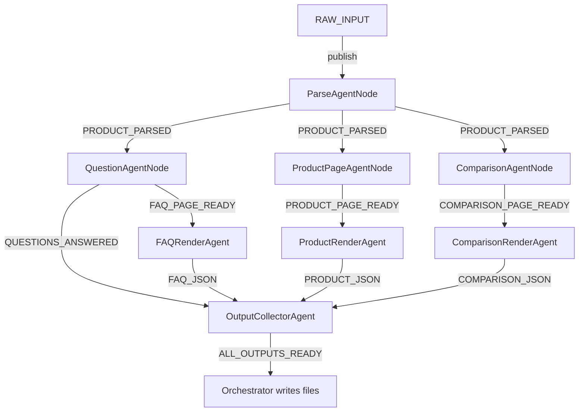

# Kasparro – Agentic Content Generation System

A modular, event-driven multi-agent Python system that ingests a small product dataset and generates structured, machine-readable content pages (FAQ, Product Description, Comparison) using reusable content logic blocks and custom templates.

---

## Highlights
- EventBus-based pub/sub orchestration (no static call chain)
- Clear agent boundaries (single responsibility, explicit I/O contracts)
- Reusable content logic blocks (formatting, normalization, comparisons)
- Template-driven, deterministic JSON output
- Built-in deterministic "Product B" for comparisons (no network calls)

---

## Quick Start

Prerequisites:
- Python 3.8+

Install dependencies:
- This repository uses only the Python standard library; no extra packages are required.

Run the pipeline with a sample product:
- macOS/Linux/Windows (PowerShell):
  - `python run.py`

Outputs (written to `outputs/`):
- `outputs/faq.json`
- `outputs/product_page.json`
- `outputs/comparison_page.json`
- `outputs/all_questions.json`

Run tests:
- `python run_tests.py`

Continuous Integration:
- A GitHub Actions workflow (`.github/workflows/python-tests.yml`) runs the test suite on pushes and pull requests.

---

## How It Works (Message-Passing Graph)



---

## Repository Structure
- `run.py` – Example entrypoint that feeds a sample product and writes outputs
- `run_tests.py` – Test runner that discovers and executes tests in `tests/`
- `src/`
  - `agent_core.py` – Message dataclass, Agent protocol, synchronous EventBus
  - `models.py` – Typed dataclasses for Product, Question, FAQ/Product/Comparison pages
  - `orchestrator.py` – Wires the graph, publishes `RAW_INPUT`, captures final outputs, writes files
  - `agents/`
    - `bus_agents.py` – EventBus-facing agent nodes: Parse/Question/Product/Comparison/Collector
    - `parser_agent.py` – Parses a raw dict to a normalized `Product`
    - `question_agent.py` – Generates and answers categorized questions; builds `FAQPage`
    - `product_page_agent.py` – Builds `ProductPage` sections using blocks
    - `comparison_agent.py` – Creates deterministic Product B and `ComparisonPage`
    - `render_agents.py` – Applies templates and emits JSON messages
  - `blocks/`
    - `questions.py` – Question generation and grounded answering rules
    - `transform.py` – Formatting helpers, normalization, list comparisons, summaries
  - `templates/`
    - `faq_template.py`, `product_template.py`, `comparison_template.py` – Define schemas and render JSON
- `tests/test_pipeline.py` – End-to-end pipeline test
- `docs/projectdocumentation.md` – Design overview and constraints

---

## Input and Output Schemas

Input (example) provided to the orchestrator as `RAW_INPUT` payload:
```
{
  "Product Name": "GlowBoost Vitamin C Serum",
  "Concentration": "10% Vitamin C",
  "Skin Type": "Oily, Combination",
  "Key Ingredients": "Vitamin C, Hyaluronic Acid",
  "Benefits": "Brightening, Fades dark spots",
  "How to Use": "Apply 2–3 drops in the morning before sunscreen",
  "Side Effects": "Mild tingling for sensitive skin",
  "Price": "₹699"
}
```

Outputs (high-level):
- FAQ JSON (`faq.json`)
  - `{ product_name: str, faqs: [{ category, question, answer }] }` (≥ 5 items enforced by template)
- Product Page JSON (`product_page.json`)
  - `{ name, concentration, skin_types[], ingredients[], benefits[], usage, side_effects, price, sections{...} }`
- Comparison Page JSON (`comparison_page.json`)
  - `{ product_a{...}, product_b{...}, comparisons{ section -> { a, b, summary } } }`
- All Questions (`all_questions.json`)
  - Flat list of question-answer pairs across categories

All outputs are UTF-8 encoded JSON with stable formatting and no external dependencies.

---

## Programmatic Usage

```python
from src.orchestrator import Orchestrator

raw = {
    "Product Name": "GlowBoost Vitamin C Serum",
    "Concentration": "10% Vitamin C",
    "Skin Type": "Oily, Combination",
    "Key Ingredients": "Vitamin C, Hyaluronic Acid",
    "Benefits": "Brightening, Fades dark spots",
    "How to Use": "Apply 2–3 drops in the morning before sunscreen",
    "Side Effects": "Mild tingling for sensitive skin",
    "Price": "₹699",
}

orch = Orchestrator()
outputs = orch.run(raw)
orch.write_outputs(outputs)
```

---

## Design Principles
- Single responsibility per agent; explicit message I/O
- Synchronous, deterministic EventBus for this use case
- No hidden global state; all data flows through messages
- Reusable content logic blocks for normalization and summaries
- Template layer enforces structure and validates required fields

---

## Testing
- Run `python run_tests.py` for the end-to-end test.
- The suite verifies, among other things, normalization behavior (e.g., converting an en-dash to a hyphen in the phrase "Apply 2–3 drops" → "Apply 2-3 drops").
- Suggested future tests: unit tests for `blocks/transform.py` and `blocks/questions.py`, and jsonschema validation.

---

## Contributing
- Open a pull request with a clear description and tests when appropriate.
- Keep agents single-purpose and avoid introducing hidden global state.