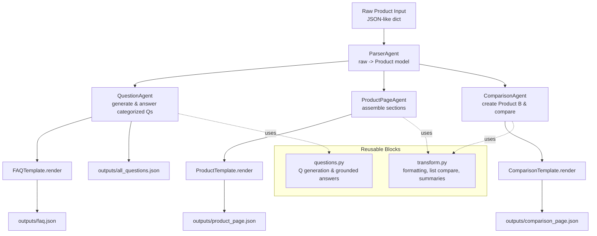

# Kasparro – Agentic Content Generation System

A modular, multi-agent Python system that ingests a small product dataset and generates structured, machine-readable content pages (FAQ, Product, Comparison) using reusable content logic blocks and custom templates.

Key features
- Clear agent boundaries (Parser, Question, Product Page, Comparison)
- Orchestrated DAG flow (not a monolith)
- Reusable content logic blocks
- Custom templates with JSON output
- Deterministic fictional Product B for comparison

How it works (flowchart)

```mermaid
flowchart TD
  A[Raw Product Input<br/>JSON-like dict] --> B[ParserAgent<br/>raw -> Product model]
  B --> C[QuestionAgent<br/>generate & answer categorized Qs]
  B --> D[ProductPageAgent<br/>assemble sections]
  B --> E[ComparisonAgent<br/>create Product B & compare]

  C --> C1[FAQTemplate.render]
  D --> D1[ProductTemplate.render]
  E --> E1[ComparisonTemplate.render]

  C1 --> O1[outputs/faq.json]
  D1 --> O2[outputs/product_page.json]
  E1 --> O3[outputs/comparison_page.json]
  C --> O4[outputs/all_questions.json]

  subgraph Reusable Blocks
    X1[transform.py<br/>formatting, list compare, summaries]
    X2[questions.py<br/>Q generation & grounded answers]
  end

  C -. uses .-> X2
  D -. uses .-> X1
  E -. uses .-> X1
```

Project structure
- src/models.py: Dataclasses for Product, Question, and pages
- src/blocks/: Reusable content logic (transform.py, questions.py)
- src/agents/: Single-responsibility agents
- src/templates/: Template renderers for JSON pages
- src/orchestrator.py: Coordinates the DAG and writes JSON
- run.py: Entry point (runs the whole pipeline)
- docs/projectdocumentation.md: System design and documentation

Setup
- Python 3.10+
- Optional: create a venv
  - python -m venv .venv
  - .venv\\Scripts\\activate
- Install nothing extra (stdlib only)

Run
- python run.py
- Generated files:
  - outputs/faq.json
  - outputs/product_page.json
  - outputs/comparison_page.json
  - outputs/all_questions.json

Design notes
- Only uses provided facts; missing values render as "Not specified".
- Q&A priority ensures specific intents (concentration, price) answered before generic prompts.
- Easy to extend with new agents or templates via orchestrator wiring.

